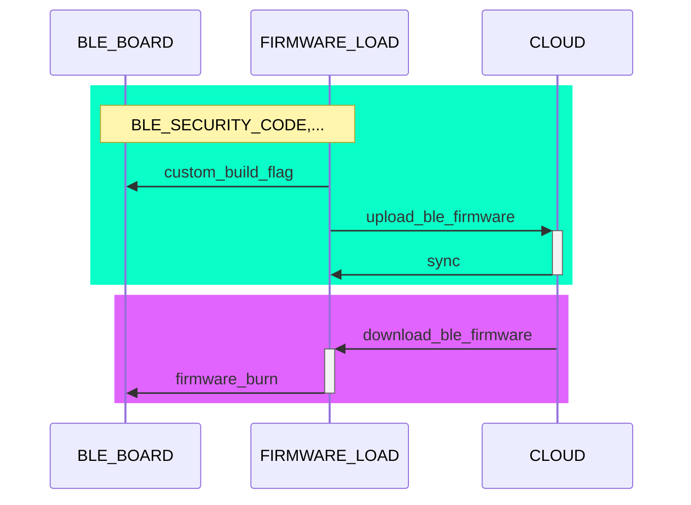
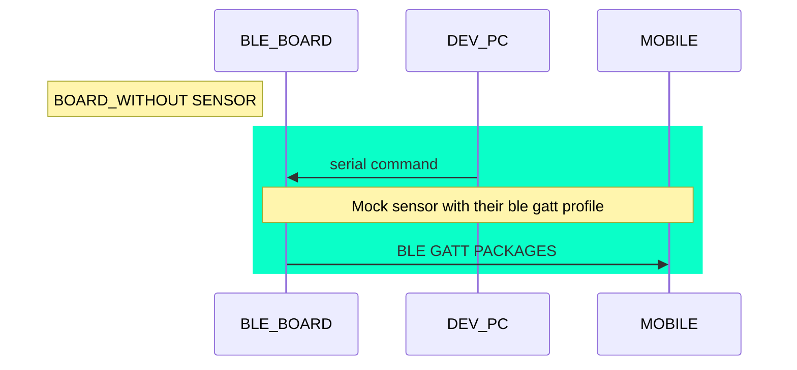

# gateway-toolkit

Repository will be took in consideration **after (v1.0.0)** to implement toolkit (support app) matter to enhance developemnt life cycle

#### product support software
1. **Firmware uploader** (app) program support oragnization able to customise BLE board build flag & manged their board configureation

2. BLE Emulator suite via serial comunication & web | app | web interface. Developer able to mock BLE value in custom step with delay(ms) and test(stress) gateway app

